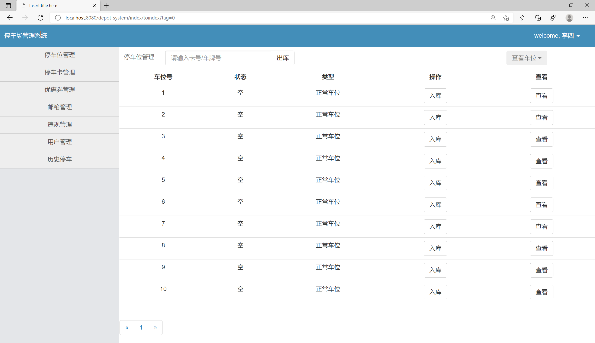
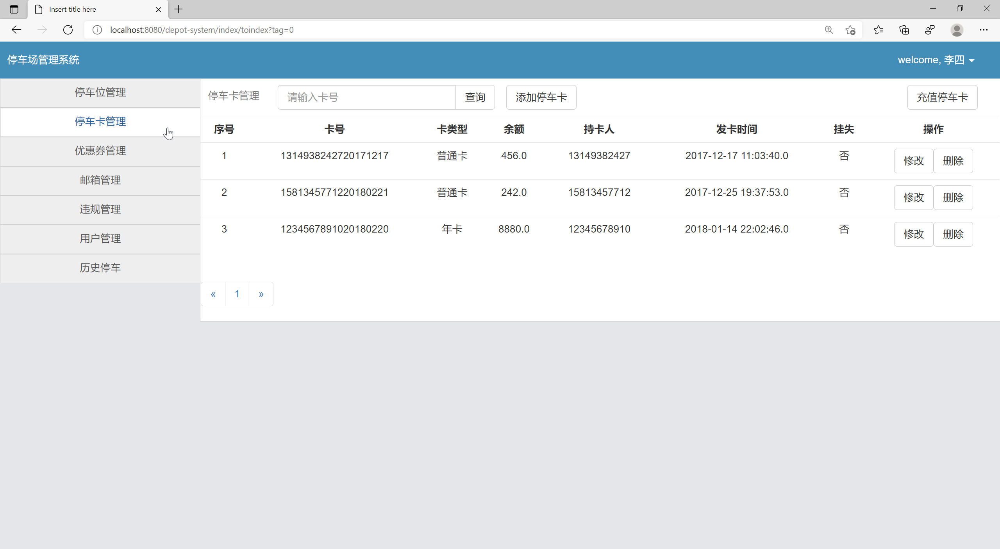
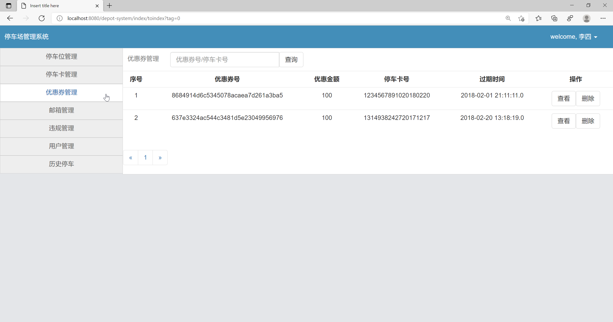
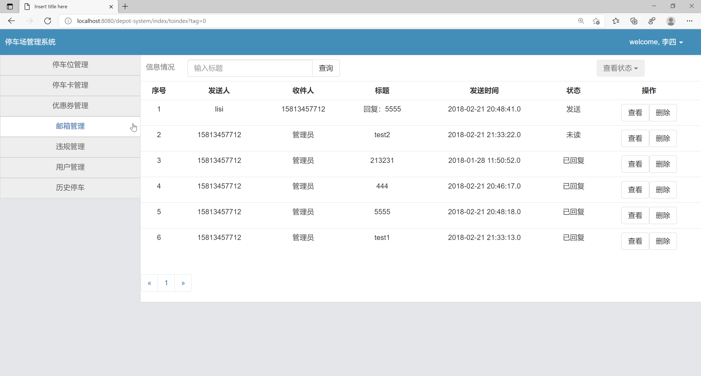
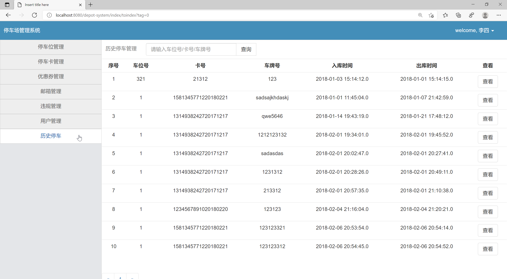
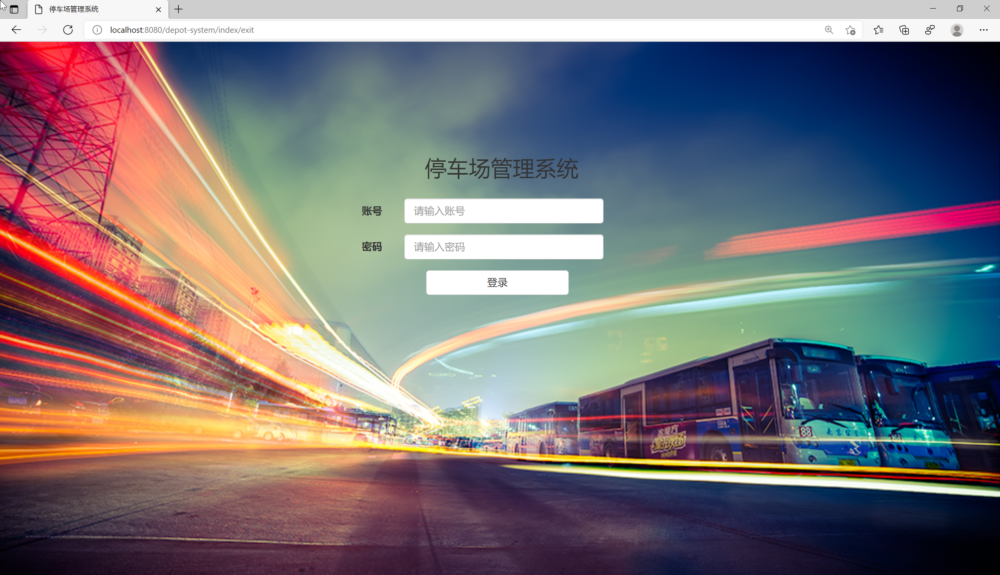
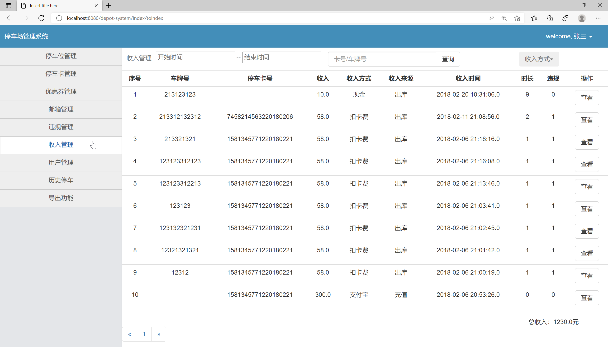
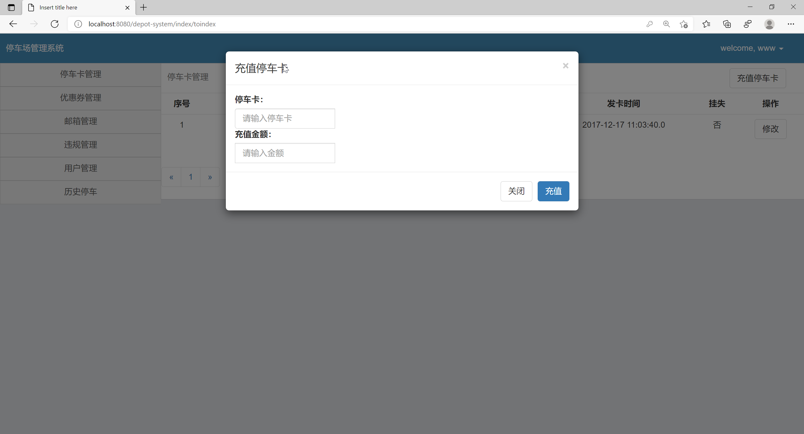

## 基于SSM+Redis的停车场管理系统

- <b>完整代码获取地址：从戎源码网 ([https://armycodes.com/](https://armycodes.com/))</b>
- <b>技术探讨、资料分享，请加QQ群：692619798</b> 
- <b>作者微信：19941326836  QQ：952045282</b> 
- <b>承接计算机毕业设计、Java毕业设计、Python毕业设计、深度学习、机器学习</b>
- <b>选题+开题报告+任务书+程序定制+安装调试+论文+答辩ppt 一条龙服务</b>
- <b>所有选题地址 ([https://github.com/YuLin-Coder/AllProjectCatalog](https://github.com/YuLin-Coder/AllProjectCatalog)) </b>

## 项目介绍
基于SSM+Redis的停车场管理系统，系统有3权限：用户，管理员，超级管理员，主要功能如下。

【停车位管理】
管理员和超级管理员可以管理停车位的分配和状态，包括添加、编辑和删除停车位信息。
【停车卡管理】
用户、管理员和超级管理员可以对停车卡进行管理，包括临时停车卡、正常卡、月卡和年卡等类型
【优惠券管理】
用户、管理员和超级管理员可以管理优惠券的发放和使用，包括添加、编辑和删除优惠券
【邮箱管理】
用户、管理员和超级管理员可以管理邮箱信息，包括添加、编辑和删除邮箱，
【违规管理】
用户、管理员和超级管理员可以管理违规行为，包括添加、编辑和删除违规记录
【收入管理】
超级管理员可以管理停车场的收入情况
【用户管理】
用户、管理员和超级管理员可以管理用户账号
【历史停车】
用户、管理员和超级管理员可以查看历史停车记录，包括停车时间、费用和停车位等信息，方便查询和管理。
【导出功能】
超级管理员可以导出收入信息

## 项目技术
- 编程语言：Java
- 数据库：MySQL
- 前端技术：JSP、JavaScript、jquery
- 后端技术：Spring、SpringMVC、MyBatis、Redis

## 运行环境
- JDK版本：JDK1.8及以上
- 开发工具：IDEA、Ecplise、Myecplise都可以
- 数据库: MySQL5.7及以上

## 运行截图

